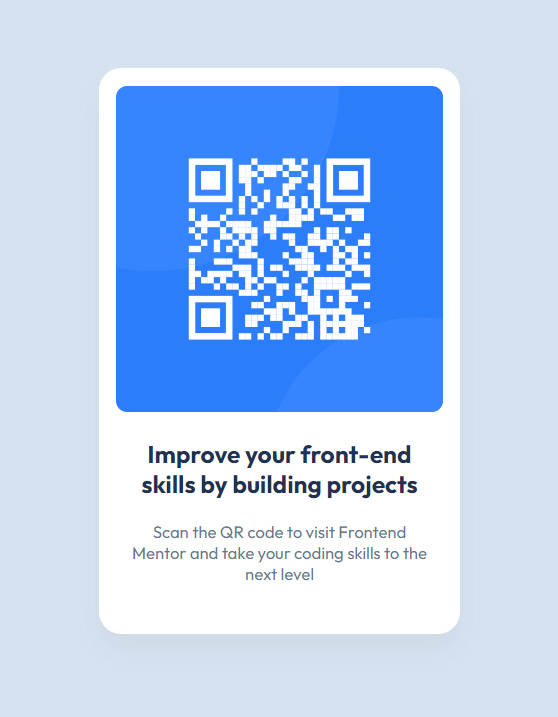

# Frontend Mentor - QR code component solution

This is a solution to the [QR code component challenge on Frontend Mentor](https://www.frontendmentor.io/challenges/qr-code-component-iux_sIO_H). Frontend Mentor challenges help you improve your coding skills by building realistic projects. 

## Table of contents

- [Overview](#overview)
  - [Screenshot](#screenshot)
  - [Links](#links)
- [My process](#my-process)
  - [Built with](#built-with)
  - [What I learned](#what-i-learned)
  - [Continued development](#continued-development)
- [Author](#author)

## Overview

### Screenshot



### Links

- Solution URL: [Add solution URL here](https://github.com/MrLanter/qr-code-frontend-mentor)
<!-- - Live Site URL: [Add live site URL here](https://your-live-site-url.com) -->

## My process

### Built with

- CSS custom properties
- Flexbox

### What I learned

```html
<div><p>I like the center</p></div>
```
```css
.center-fan {
  display: flex;
  justify-content: center;
  align-items: center;
  width: 100%;
  height: 100%;
}
```

### Continued development

Add contrast with a nice box shadow when needed

## Author

- Frontend Mentor - [@yourusername](https://www.frontendmentor.io/profile/MrLanter)
